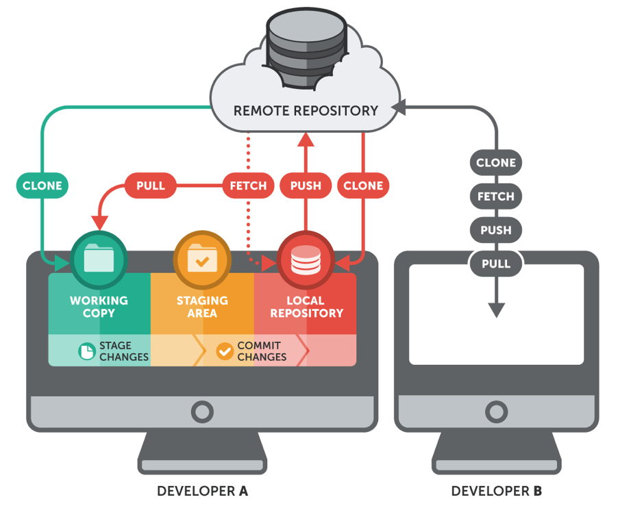

# Git Version Control

## Basics
Created in 2005, Git is one of the most widely used Version Control Systems to date. To understand version control, imagine you are working on an intensive Java game when all of a sudden, your program crashes. All progress over the past two weeks is lost and you have to start over from the beginning. What a nuisance.

Introducing Git, a Unix based program that serves two powerful purposes.
1. Keep track of computer file revisions
2. Distribute work on computer files among multiple people.
Git is popular among computer scientists across all levels as a source code management tool. With Git, you can save working copies of coding projects, revert broken to code to the latest working version, create different branches of the same code, and organize collaboration among friends. Don't worry if some of these don't make sense. Once you get the hang of it, learning git becomes a very organic process.

To understand the true power of Git, another way to understand its utility is outside the context of programming. In fact, you can use Git to save changes for anything, from PDFs to JPGs to GIFs. The whole idea of Git is as an elaborate, well-documented 'save' function. A Git file is capable of recording any changes for any computer file across any period of time. :open_mouth:

 

## Github vs. Git
Github is a company that allows you to save your git history to a remote server. In contrast, git by itself performs the above operations on a 'local' level, which just means that everything you do happens and stays on your computer. Github is a company that allows you to save your local git changes to a remote server. Their website serves as an online platform that allows you to view revisions and monitor collaborations through a fantastic UI. In addition, in case anything happens to your computer, your code will be recoverable and safe as long as you've committed it to Github. It's a fantastic resource.

## Resources
1. Git Cheat Sheet: https://www.git-tower.com/blog/git-cheat-sheet/
2. Git Tutorial (In Depth): https://www.tutorialspoint.com/git/
3. Official Git Documentation: https://git-scm.com/documentation
4. Student Developer Pack :raised_hands:: https://education.github.com/pack

Happy Committing! - :octocat:
