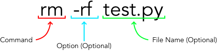
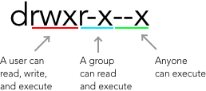
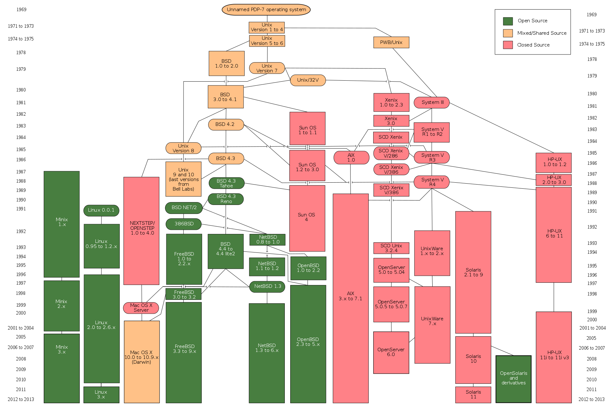

# Unix :floppy_disk:

## Basics :straight_ruler:
Unix is a very significant language in the evolution of computer science. In a very general sense, UNIX is the language that allows you to navigate your operating system on a raw level. When you navigate Finder on Mac or File Systems on Windows, you're essentially traversing through a user interface of terminal. Since it was created in the 1970s, many 'flavors' of unix have been developed, some of which have materialized into the most operating systems today, including Apple's macOS and Linux.

Unix is a brutally simple language. Every command is very straightforward and guarantees efficient execution. The trick is making sure you know what you're doing. Don't worry. At the start, Unix will definitely come off as very unwieldy and monotonous compared to what you're used to. But trust, once you get the hang of things, you'll forget the days where you slowly point-and-clicked through file systems, in favor of 'ls' and 'cd'-ing through directories. :muscle:

## Anatomy of a Unix Command :bust_in_silhouette:

A unix command is followed by options, also known as flags. They modify the intricacies regarding how the command is executed. More often than not, a command will also require some form of input that you type afterwards

## List of Unix Commands :clipboard:

### File Management  :file_folder:
Command | Purpose | Options
--- | --- | ---
ls | List items in your current directory | a (hidden files), l (long format)
cd (dir) | Change directory | .. (up one dir.), / (root dir.), ~ (home dir.)
pwd | Print working directory
mkdir (dir) | Create a directory named 'dir'
rm (dir / file) | Remove a file or directory | r (recursive), f (force)
cp (file1) (file2) | Copy file1 to file2 | r (recursive)
mv (file1) (file2) | Move file1 to file2
cat/head/tail/more/less (file) | View a file's contents
touch (file) | Create new file named 'file'
vim (file) | Edit a file using Vim text editor | Excellent tutorial [here](http://www.openvim.com)

### Permissions :warning: + Process Management :construction_worker: + Searching :mag:
Command | Purpose | Options
--- | --- | ---
chmod (octal) (file) | Change File Permissions | Click [here](https://www.computerhope.com/unix/uchmod.htm) for in depth explanation
grep | Search for a pattern in files | Very powerful command, read more [here](http://www.uccs.edu/~ahitchco/grep/)
kill (process id) | Kill a process identified with id | 9 (force kill)
ps | Display active processes
top | Display running processes (equivalent of activity monitor)
htop | More colorful 'top' | run 'apt-get install htop' to install

*'chmod' Brief Explanation*
This command changes the permissions for files. If you type 'ls -l' in a directory, you'll a notice column with strings that seem like  random combinations of 'r', 'w', 'x', '-'. That string actually details the permissions on that file.

'r' means 'read', 'w' means 'write', and 'x' means execute. These are the three things you can do to a file.

The permissions string is organized in a way where the first three characters refer to what the user can do to the file. The next three establish what members of your group can do, while the last three characters state what anybody is allowed to do.

Chmod is a command that allows you to change your permissions. The octal is a 3 digit number where each digit corresponds to permissions on different levels. In other words, the first digit corresponds to the user's permissions, while the second digit is the group's permissions and so on.

* read (r) = 4
* write (w) = 2
* execute (x) = 1

Based on a digit's value, you specify what permissions are allowed.
* 7 = 4 + 2 + 1 ~ read, write, and execute are all allowed
* 5 = 4 + 1 ~ read and execute are allowed.
* 2 = 2 ~ only writing is allowed.

In conclusion,
* chmod 777 example.py - read, write, and execute for all
* chmod 755 example.py - rwx for owner, rx for group + world

### System Information + Miscellaneous :heavy_exclamation_mark:
Command | Purpose
--- | ---
cal | This month's calendar
date | Today's date + time
df | Show disk usage
du | Show directory space usage
echo (text) | Prints text in terminal
finger (user) | Display information about user
history | Numbered list of most recent commands (use grep to search)
man (command) | Retrieve manual for a command
uptime | How long computer has been working + availability
w | Display who's online
which (application) | Prints path location of app that will be run
whoami | Display logged in user

### Keyboard Commands :computer:
Command | Purpose
--- | ---
Ctrl + c | Halts current command
Ctrl + z | Stops current command, resumes with most recent process
Ctrl + w | Deletes last word in current line
Ctrl + u | Erases entire line
Ctrl + d / exit | Log out of current session (closes window)
!! | Repeat previous command
Up Arrow | Go through previous commands

## Resources :closed_book:
1. Tutorials Point: https://www.tutorialspoint.com/unix/index.htm
2. Cheat Sheet: http://cheatsheetworld.com/programming/unix-linux-cheat-sheet/
3. A Unix Easter Egg :egg:: type 'telnet towel.blinkenlights.nl', then enter

History of Unix

